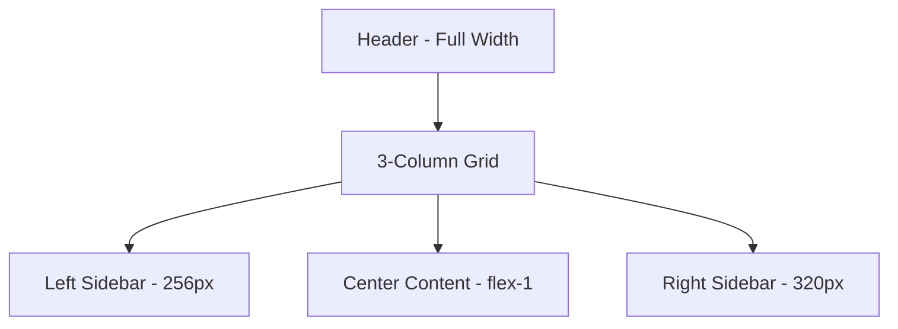

# SPEC_UI: Plug and Say Dashboard Facelift

This document defines the technical and visual specification for transforming the Plug and Say UI into a professional, high-fidelity dashboard.

## 1. Design System (index.css)

We will use **Tailwind CSS 4.0** (Vite plugin) for all styling. Global tokens will be defined in `src/index.css`.

### Color Palette
- **Background**: `bg-[#F7F4F0]` (Warm Cream)
- **Surface**: `bg-white` (Cards and panels)
- **Border**: `border-[#E5E0D8]` (Subtle separation)
- **Text Primary**: `text-[#1A1A1A]` (Deep Slate)
- **Text Secondary**: `text-[#6B665E]` (Muted Taupe)
- **Accent**: `bg-[#EBE7E0]` (Hover states / secondary buttons)

### Typography
- **Sans**: `font-sans` (Inter / System Default) - Main content.
- **Mono**: `font-mono` (Geist Mono / JetBrains Mono) - Status badges, ID tags, and counters.

### Shared Classes
- **Glass Card**: `bg-white/80 backdrop-blur-md border border-[#E5E0D8] rounded-2xl shadow-sm`
- **Working Pulse**: `animate-pulse bg-emerald-500` (Status indicator)

---

## 2. Layout Architecture (App.tsx)

Refactor `App.tsx` from a vertical stack to a **Horizontal 3-Column Grid**.

### Components
- **TopNav**: Fixed height `h-16`, sticky at the top. Dashboard title, Global Stats, Clock.
- **LeftSidebar**: `p-4 overflow-y-auto`. Contains `AgentSidebar`.
- **MainContent**: `p-6 bg-[#F7F4F0] min-h-screen`. Dynamic Kanban Board.
- **RightSidebar**: `p-4 border-l border-[#E5E0D8] bg-white/50`. Contains `LiveFeed`.

---

## 3. Component Specifications

### [A] AgentSidebar
- **Container**: `space-y-3`.
*Card-based list showing Avatar, Name, Role (Lead/Spc/Int badges), and "WORKING" pulse indicator.*
- **Badge Styles**:
  - `Lead`: `bg-amber-100 text-amber-800`
  - `Specialist`: `bg-blue-100 text-blue-800`
  - `Intern`: `bg-gray-100 text-gray-800`

### [B] KanbanBoard
- **Board**: `flex gap-4 overflow-x-auto pb-4 h-[calc(100vh-120px)]`.
- **Column**: `w-72 flex-shrink-0 flex flex-col`.
- **ColumnHeader**: `flex justify-between items-center px-2 mb-4`.
  - Title: `text-sm font-bold uppercase tracking-wider text-slate-500`.
  - Counter: `bg-[#E5E0D8] px-2 py-0.5 rounded text-xs font-mono`.

### [C] TaskCard
- **Style**: `bg-white p-4 rounded-xl border border-[#E5E0D8] shadow-sm hover:shadow-md transition-all cursor-pointer`.
- **Elements**: 
  - Title: `text-sm font-semibold mb-2`.
  - Assignees: Small overlapping avatars at the bottom-right.
  - Priority: Colored dot left of title.

### [D] LiveActivityFeed
- **Item**: `text-xs py-2 border-b border-[#F0EDEA] last:border-0`.
- **Metadata**: `text-slate-400 font-mono tracking-tighter`.
- **Timestamp**: `opacity-60 italic`.

---

## 4. Implementation Phases

### Phase 1: The Shell (Desktop Grid)
- [ ] Update `index.css` with the Warm Cream theme.
- [ ] Refactor `App.tsx` to handle the 3-column shell using Tailwind Grid/Flex.
- [ ] Clean up all inline `style` props in favor of Tailwind classes.

### Phase 2: Header & Agents Sidebar
- [ ] Implement `TopNav` with real-time stats.
- [ ] Create `AgentSidebar` fetching from `api.agents.list`.
- [ ] Add "Pulse" status indicators for active agents.

### Phase 3: Kanban Refactor
- [ ] Globalize `Column` and `TaskCard` logic.
- [ ] Implement horizontal scrolling board.
- [ ] Add priority indicator logic based on task metadata.

### Phase 4: Activity Feed & Polish
- [ ] Implement `LiveActivityFeed` fetching from `api.activities.listRecent`.
- [ ] Add micro-animations (Framer Motion) for task transitions.
- [ ] Final color calibration and accessibility check.
